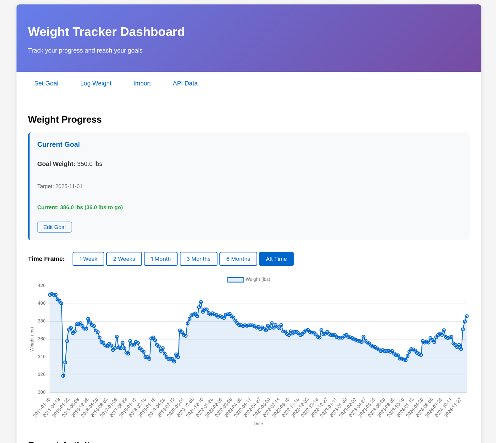

# Fatboy

A personal weight tracking app that was 100% vibe coded in a couple of hours.



Created after I canceled my $20 a month myfitnesspal subscription and could not extract the historical data going back to 2011 without a premium subscription.

Unfortunately I had to again pay for premium to get the data which really made me upset.

## Hosting

This tool is meant to be used only in private networks. It is hosted on my internal network and I access to via wireguard.

## Editor

The tool was built using Neovim 0.11+ with CodeCompanion and Claude Sonnet 4.

To start the editor:

```fish
set -gx ANTHROPIC_API_KEY "foo"
nvim -u nvim.lua
```

## How to run

### Locally

```fish
v . && ./fatboy
```

### systemd

Coming soon!
